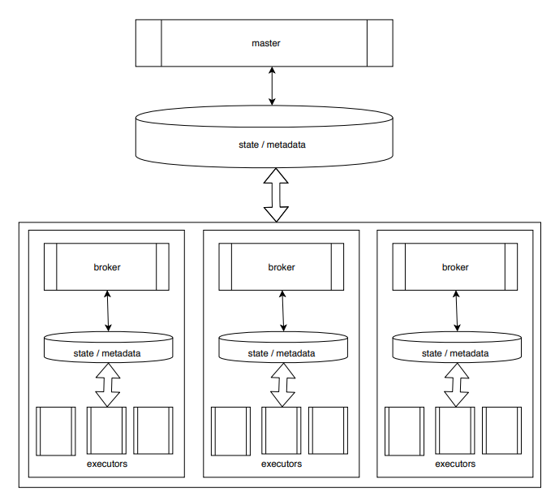

# DagScheduler

[](https://travis-ci.org/tanmaykm/DagScheduler.jl)
[](https://coveralls.io/github/tanmaykm/DagScheduler.jl?branch=master)
[](http://codecov.io/github/tanmaykm/DagScheduler.jl?branch=master)

Computational problems can often be represented as specific types of graphs known as [directed acyclic graphs (DAGs)](https://en.wikipedia.org/wiki/Directed_acyclic_graph). That allows an execution framework to execute parts in right order, schedule in parallel, and make optimal use of available resources.

DagScheduler.jl is a package that can execute DAGs in parallel across multiple machines. [Dagger](https://github.com/JuliaParallel/Dagger.jl) is another such executor for DAGs in Julia. DagScheduler uses the same underlying DAG representation of Dagger. And it is designed to be used in place of the the default scheduler of Dagger;  scheduler logic in Dagger can be replaced/plugged in.

DagScheduler attempts to do better on the following goals:

- scalability
    - scheduling load is distributed
    - data locality (and locality of intermediate results) is taken into account
    - coarse grained (sub-tree level) scheduling at master
    - per node (task level) scheduling by brokers
- asynchronicity
    - data transfer does not block computation
    - inter-node io is offloaded to brokers
    - inter-process (within a node) io is via memory mapped files / shared memory
- resilience against node / process failures
    - external metadata stores provide resilient storage for state and results
    - master detects failures and re-schedules tasks assigned to failed nodes

[Here are some visualizations](test/viz/README.md) of task graphs illustrating how they are scheduled.

## QuickStart

These are a the packages that need to be cloned:

```
julia> Pkg.clone("https://github.com/JuliaComputing/DagScheduler.jl.git")

julia> Pkg.clone("https://github.com/tanmaykm/Semaphores.jl.git")

julia> Pkg.clone("https://github.com/tanmaykm/SharedDataStructures.jl.git")

julia> Pkg.clone("https://github.com/tanmaykm/RemoteMonitor.jl.git")

```

To get started, just add `using DagScheduler` in your project that uses Dagger. It will plug itself in and take over scheduling from Dagger. Just make sure that this is done after all proceses are added, so that it is included on all workers as well.

Example:

```
julia> addprocs(4);

julia> using Dagger, DagScheduler, Base.Test

julia> x = shuffle(1:10^6);

julia> X = distribute(x, 4)
Dagger.DArray{Any,1,Base.#cat}(1000000,)

julia> X.chunks
4-element Array{Union{Dagger.Chunk, Dagger.Thunk},1}:
 Dagger.Chunk{Array{Int64,1},MemPool.DRef}(Array{Int64,1}, Dagger.ArrayDomain{1}((1:250000,)), MemPool.DRef(4, 3, 0x00000000001e8480), true)                                             
 Dagger.Chunk{Array{Int64,1},MemPool.FileRef}(Array{Int64,1}, Dagger.ArrayDomain{1}((1:250000,)), MemPool.FileRef(ip"192.168.1.35", ".mempool/sess-3f631-5/1", 0x00000000001e8480), true)
 Dagger.Chunk{Array{Int64,1},MemPool.DRef}(Array{Int64,1}, Dagger.ArrayDomain{1}((1:250000,)), MemPool.DRef(4, 2, 0x00000000001e8480), true)                                             
 Dagger.Chunk{Array{Int64,1},MemPool.DRef}(Array{Int64,1}, Dagger.ArrayDomain{1}((1:250000,)), MemPool.DRef(4, 1, 0x00000000001e8480), true)                                             

julia> Y = collect(sort(X));

julia> @test Y == sort(x)
Test Passed
```

To use the scheduler more explicitly, and in other applications (outside Dagger):

```
julia> addprocs(4);

julia> using Dagger, DagScheduler

julia> runenv = RunEnv()
RunEnv
 ↳ 192.168.1.35 [1 ⇄ 2,3,4,5]

julia> # A simple example, not really distributed
       dag = delayed(sum)([1:10;]);

julia> result = collect(rundag(runenv, dag))
55

julia> # A more complex example, that is actually distributed
       rand_means = [delayed(mean)(delayed(rand)(Float64,100)) for idx in 1:10];

julia> sum_inp = delayed((x...)->[x...], meta=true)(rand_means...);

julia> sum_means = delayed((arr)->sum(map(collect, arr)))(sum_inp);

julia> collect(rundag(runenv, sum_means))
4.938725127962009
```

## Architecture



## APIs

### RunEnv

```
function RunEnv(;
    rootpath::String="/D",
    masterid::Int=myid(),
    nodes::NodeEnvList=setup_nodes(masterid),
    debug::Bool=false,
    profile::Bool=false,
    remotetrack::Bool=false)
```

Sets up the execution environment. Parameters (optional):

- `rootpath`: A path used to identify (and isolate) execution environments. This path is used as prefix in metadata stores, and to create several OS level handles. It is good to pass a path with user id or process id suffixed.
- `masterid`: The master process. Always `myid()` as of now.
- `nodes`: A list of node environments. Each node identifies a group of processes local to one physical node. Auto-detected by default.
- `debug`: Pass `true` to switch on debugging and verbose logging.
- `profile`: Pass `true` to switch on profiling. Profile outputs are written to `/tmp/<pid>.log` after every invocation of `rundag`.
- `remotetrack`: Pass `true` to send remote tracking events to a [RemoteMonitor.jl](https://github.com/tanmaykm/RemoteMonitor.jl) listener.

### rundag

```
function rundag(
    runenv::RunEnv,
    dag::Thunk)
```

Execute a DAG and return the result.

### reset

```
function reset(
    env::RunEnv,
    nodes::NodeEnvList=setup_nodes(env.masterid))
```

Reset the execution environment to take into account any worker processes added or removed.

Nodes can be added or removed dynamically based on processing requirements.

If case of any errors while executing a DAG through `rundag`, DagScheduler attempts to automatically recover by removing the erring process / node from the execution environment and re-scheduling failed computation to other nodes. The calling program can examine the state after `rundag` returns and can choose to add new processes to replenish lost capacity.

### cleanup

```
function cleanup(runenv::RunEnv)
```

Cleans up the execution environment. The `runenv` can not be used any more after this. It is essential to have all processes intact to be able to clean up everything on remote nodes.

### NodeEnv

```
function NodeEnv(
    brokerid::Integer,
    host::IPAddr,
    executorids::Vector{Int})
```

Create a node environment instance to use while creating a custom `RunEnv`. Users typically do not need to use this directly. A valid node must have at least 3 processes - one broker and at least two executors.

Parameters:

- `host`: IP address of the node
- `brokerid`: process id to use as broker on the node
- `executorids`: process ids to use as executors on the node

### DagScheduler.Plugin.setrunenv

```
function setrunenv(runenv)
```

To intermix both Dagger DAG execution APIs and DagScheduler APIs, the same RunEnv you must share same RunEnv that you use with the Dagger scheduler plugin too. Use this API to do that. E.g.:

```
runenv = DagScheduler.Plugin.setrunenv(RunEnv())
```

## Configuration

There are a few configurable settings for DagScheduler, to configure the metadata store. The defaults are almost always fine, but some may need customization when running a large setup. The settings are kept in a dictionary `DagScheduler.META_IMPL` and must be set on all nodes before creating an instance of `RunEnv`. Settings must not be changed once set.

E.g.:

```
addprocs(20)

using Dagger,DagScheduler

@everywhere begin
    DagScheduler.META_IMPL[:map_num_entries] = 1024*100
    DagScheduler.META_IMPL[:map_entry_sz] = 1512
end

runenv = DagScheduler.Plugin.setrunenv(RunEnv())
```

Configurable items:

- `:map_num_entries`: Max number of dag node results that can be stored. A result needs to be stored when it is needed across processes. Default: `1024*5`
- `:map_entry_sz`: Max size (bytes) of each result stored in shared dict. Results are typically chunks saved to memory mapped files. Default: `256`
- `:done_tasks_sz`: Size of shared memory segment used to keep track of completed task ids on each node. Roughly: (total_dag_nodes / nphyiscal_nodes). Default: `1024*100`
- `:shared_tasks_sz`: Size of shared memory segment used to keep track of tasks shared across processes on each node. Roughly: (total_dag_nodes / nphyiscal nodes). Default: `1024*100`
- `:node`: The metadata store to use among processes within a node. Default: `"DagScheduler.ShmemMeta.ShmemExecutorMeta"`
- `:cluster`: The metadata store to use among nodes (brokers). Default: `"DagScheduler.SimpleMeta.SimpleExecutorMeta"`
